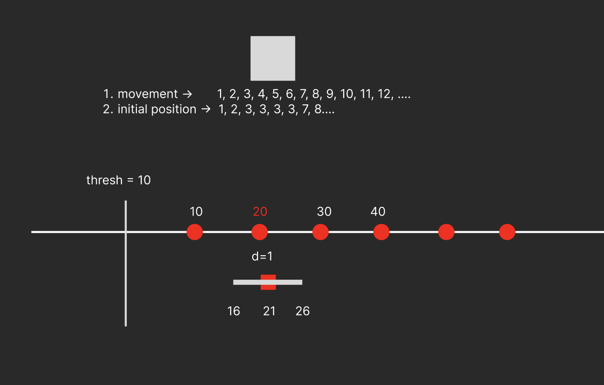

In this article, we will demonstrate how snapping works on Grida Canvas. Snapping the elements on the Grida canvas
gives you consistency in spacing between elements.

# Snapping horizontally

To see the horizontal snapping in action, visit https://app.grida.co/canvas and follow the steps below

1. Create a rectangle

2. Select the rectangle you just added and press alt and drag towards right

As you drag towards right, you do not see the snapping yet because you only have two elements added so far. Snapping uses references points based on existing elements drawn on the canvas. In this case, it is horizontal i.e., along the x-axis. Make sure you keep some visible distance between these rectangles as you drag towards right, it does not have to be too far.

3. Repeat step 2, you will now create third rectangle. Select an existing rectangle, press alt and slowly drag this rectangle towards right. As you slowly move along the x-axis, when this third rectangle is "almost" at a distance that is same as the distance between the first and the second rectangle, you will see this rectangle snapping to the point that makes these three rectangles equidistant. 

I said "almost" here because internally we use a metric called threshold, that defaults to 4, if your moving element (we call it agent) falls with in the range of being equally distant, the agent snaps to the point to make the elements equidistant

# Snapping vertically

To see the vetical snapping in action, visit https://app.grida.co/canvas and follow the steps below 

1. Create a rectangle as shown below, this rectangle should be horizontal as we stack more rectangle in the next steps
to demonstrate the vertical snapping.

2. Select the rectangle you just added and press alt and drag upwards. The difference here is "dragging upwards" where as in the horizontal snapping, you would move the rectangle towards to create a clone

The same logic applies described in step 2, i.e., you do not see a snapping point yet. There has to be atleast two elements as a reference to calculate the space between those elements and then based on that value, we snap the elements that are arouund these two elements.

3. Repeat step 2, you will now create third rectangle. Select an existing rectangle, press alt and slowly drag this rectangle upward. When this third element falls in the threshold, it snaps so that all these three elements are equidistant.

# Snapping as you center an element

To see snapping in action as you center an element, follow the steps below

1. Create a vertical rectangle, make sure to position this on the left.

2. Closer to the top, create a horizontal rectangle as shown below

3. Next, create a square and slowly try to center this element using the top and left rectangles as references. As you move this square around, you will see the lines indicating that you are at center to that referencing rectangle.

This below gif shows the indicating lines appearing when the square's center is aligned with top rectangle center and the left rectangle center

The same threshold logic applies described above, say the left rectangle center is positioned at (20,100). This is a 2D position - (x,y) on the canvas. Now let's assume your square is positioned at (100, 75). To make the centers aligned, you would move the square along the y-axis. Say, you are at (100, 96), at this point, the square snaps to (100, 100). This is because internally we have threshold of 4 units.
